## API Enpoints

### Authentication API

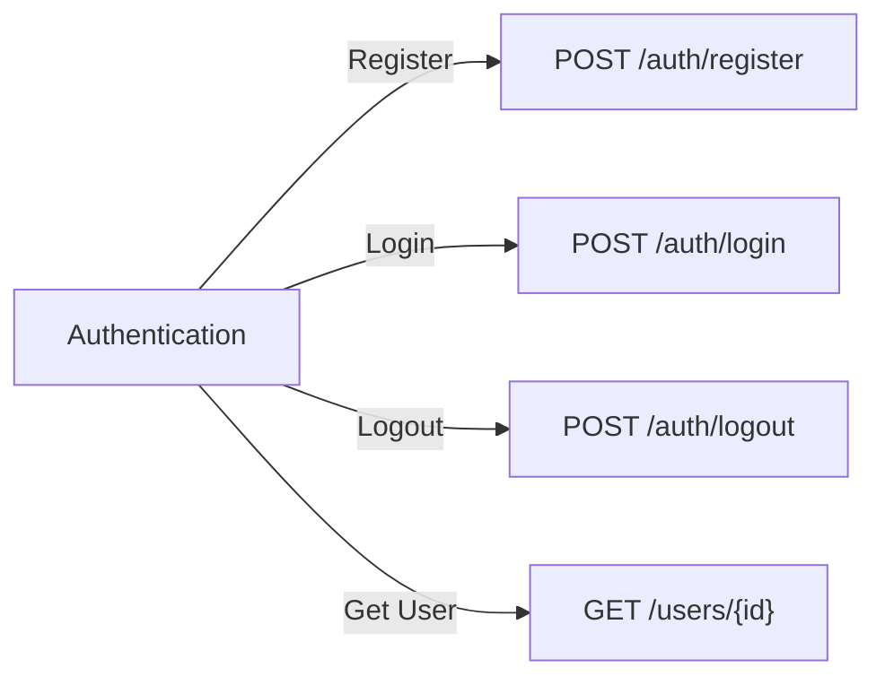

---

### Product Management API

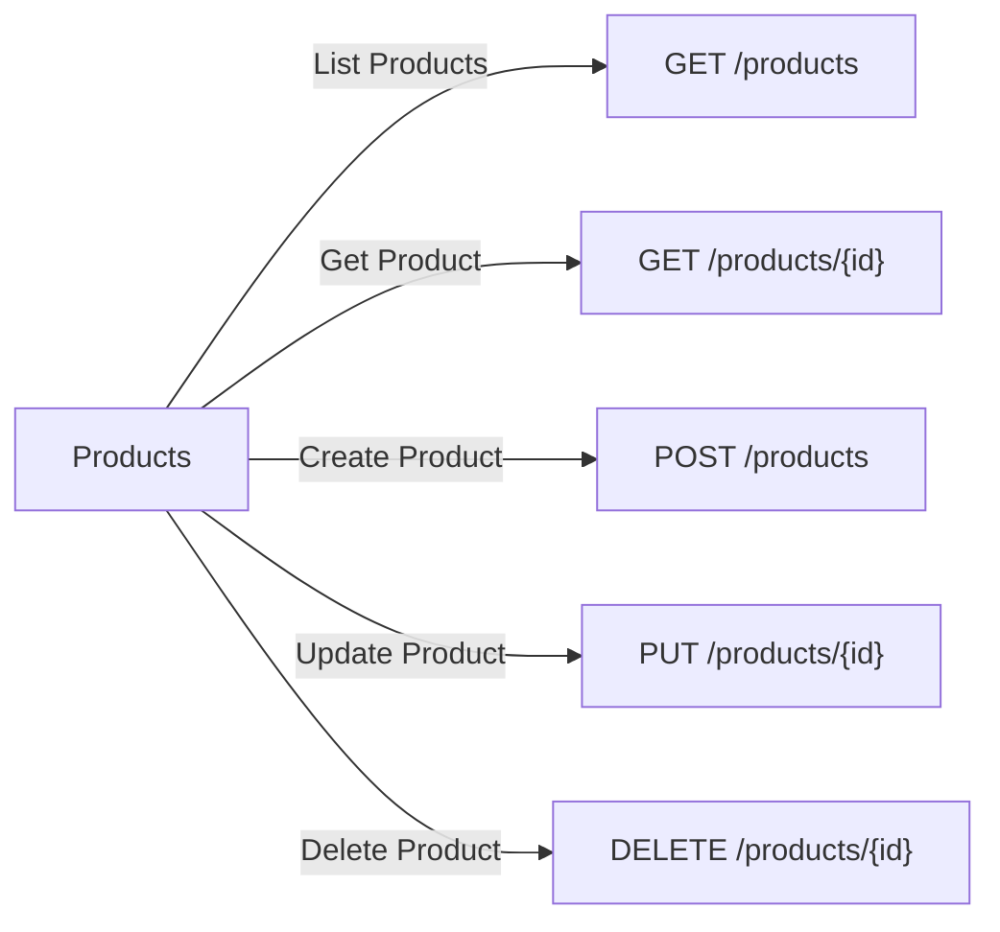

---

### Warehouse & Inventory API

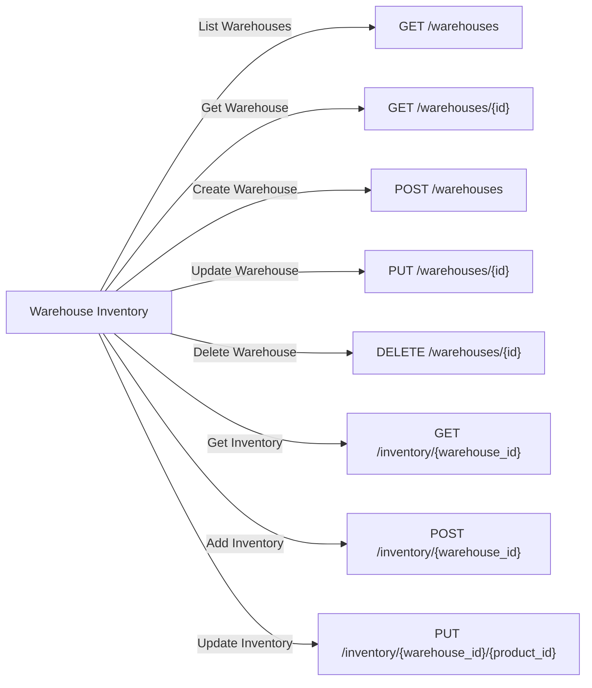

---

### Supplier & Replenishment API

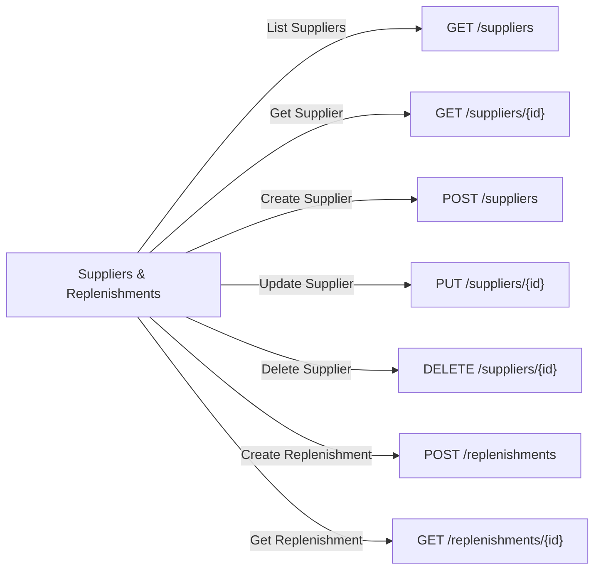

---

### Orders & Transactions API

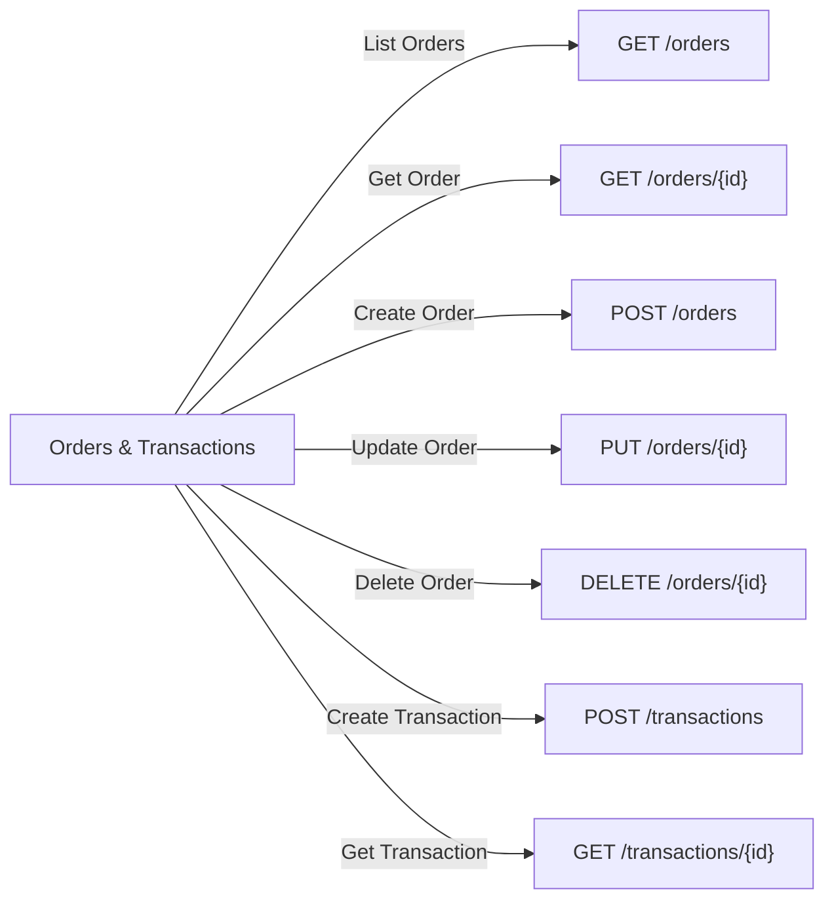

## User Flow's

### Authentication Flow

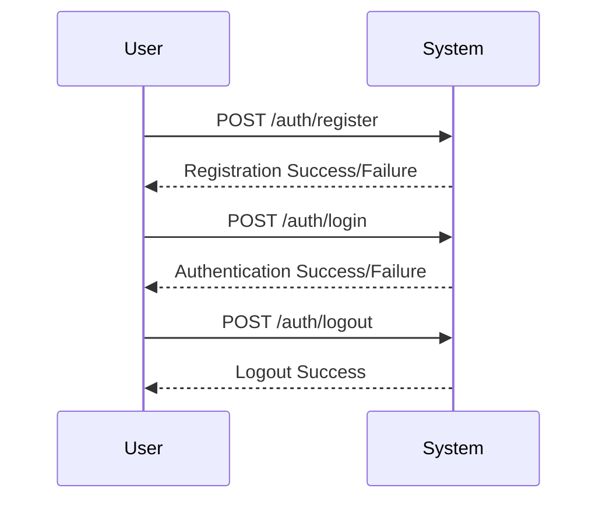

---

### Product Management

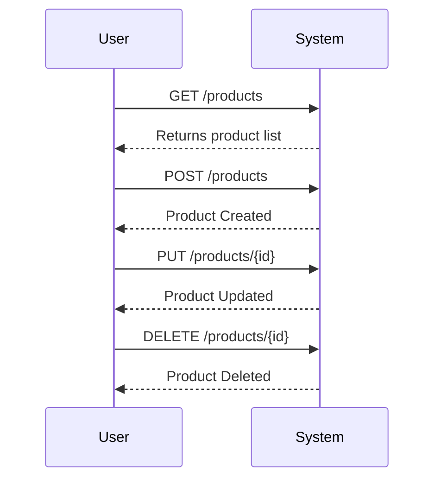

---

### Warehouse and Inventory Management

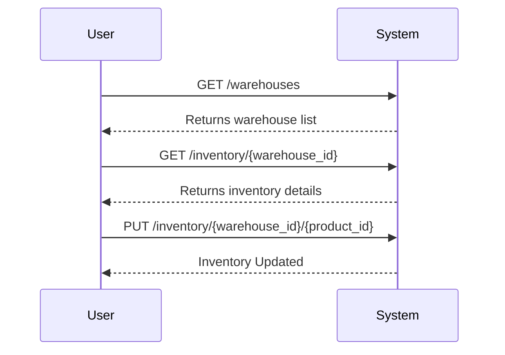

---

### Supplier and Replenishment

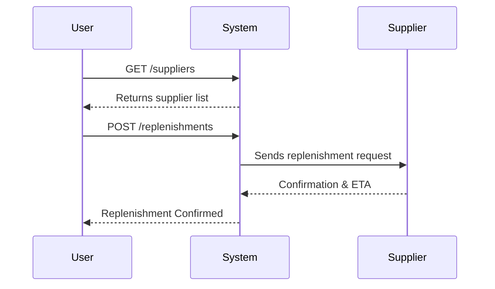

---

### Order Processing

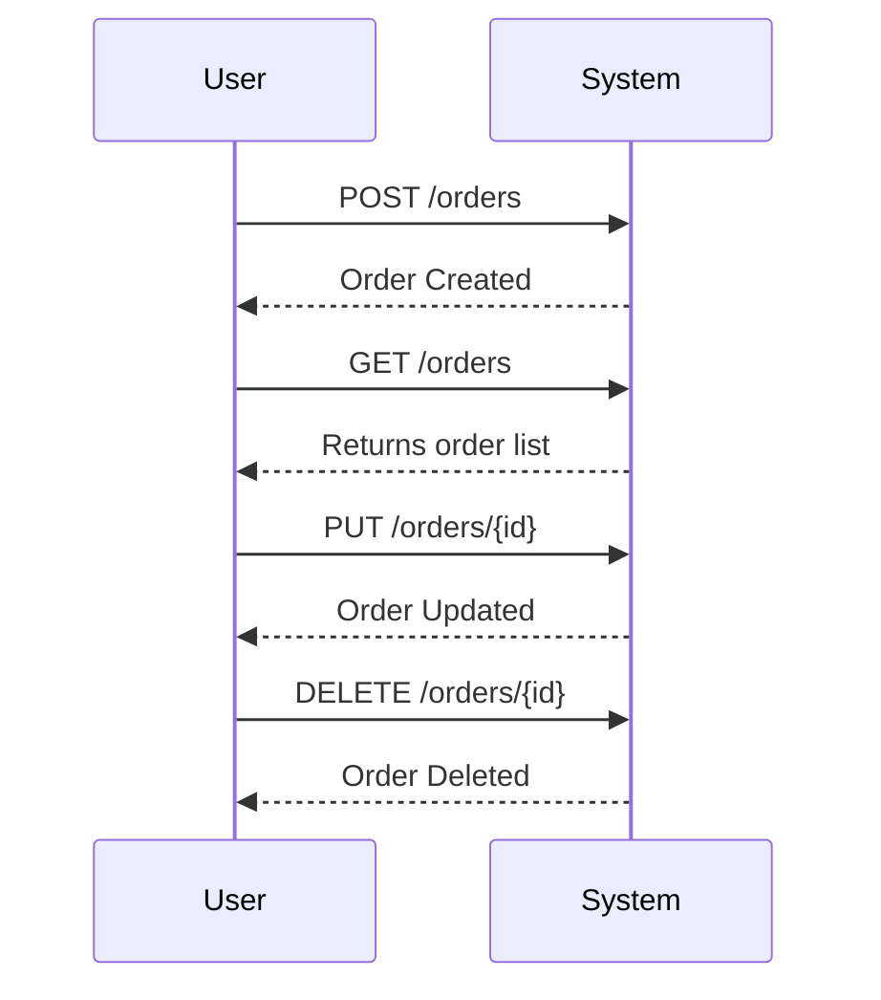

---

### Payments & Transactions

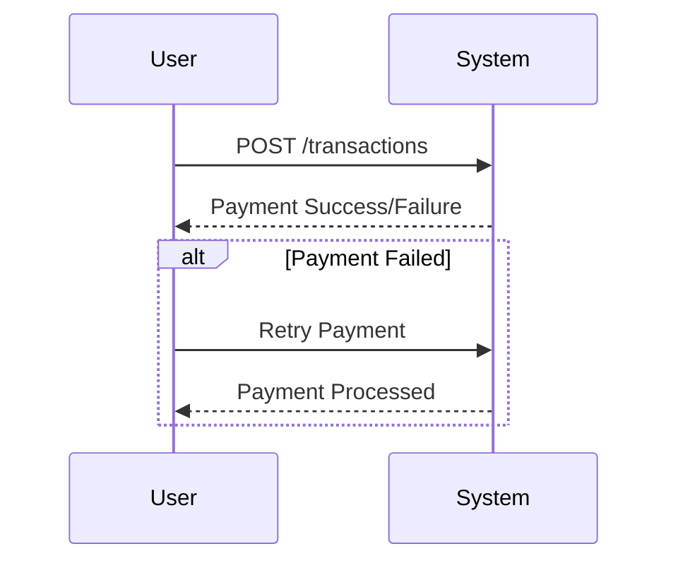

---

## Entity Relationship Diagram

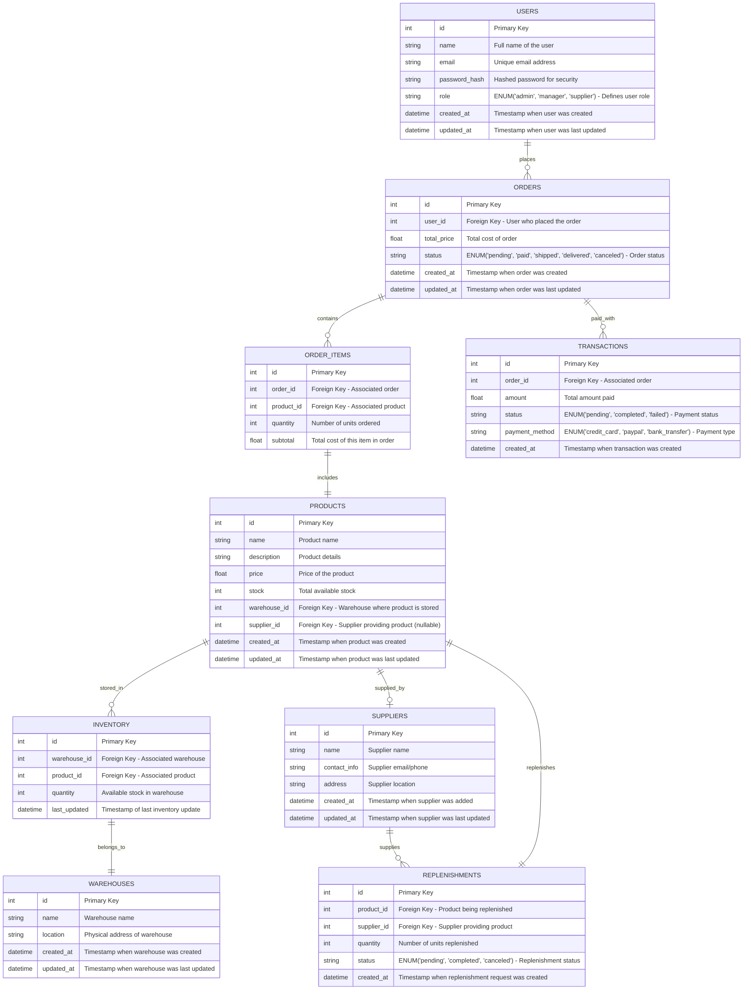

## Access Control

| **Entity**         | **Operation**                                         | **Admin** | **Manager** | **Supplier** | **Customer** |
| ------------------ | ----------------------------------------------------- | --------- | ----------- | ------------ | ------------ |
| **Users**          | Create (`POST /auth/register`)                        | ❌        | ❌          | ❌           | ✅ (Self)    |
|                    | Read (`GET /users/{id}`)                              | ✅ (All)  | ✅ (Own)    | ✅ (Own)     | ✅ (Own)     |
|                    | Update (`PUT /users/{id}`)                            | ✅ (All)  | ✅ (Own)    | ✅ (Own)     | ✅ (Own)     |
|                    | Delete (`DELETE /users/{id}`)                         | ✅ (All)  | ❌          | ❌           | ❌           |
| **Products**       | Create (`POST /products`)                             | ✅        | ✅          | ❌           | ❌           |
|                    | Read (`GET /products/{id}`)                           | ✅        | ✅          | ✅           | ✅           |
|                    | Update (`PUT /products/{id}`)                         | ✅        | ✅          | ❌           | ❌           |
|                    | Delete (`DELETE /products/{id}`)                      | ✅        | ✅          | ❌           | ❌           |
| **Warehouses**     | Create (`POST /warehouses`)                           | ✅        | ✅          | ❌           | ❌           |
|                    | Read (`GET /warehouses/{id}`)                         | ✅        | ✅          | ❌           | ❌           |
|                    | Update (`PUT /warehouses/{id}`)                       | ✅        | ✅          | ❌           | ❌           |
|                    | Delete (`DELETE /warehouses/{id}`)                    | ✅        | ❌          | ❌           | ❌           |
| **Inventory**      | Read (`GET /inventory/{warehouse_id}`)                | ✅        | ✅          | ❌           | ❌           |
|                    | Add (`POST /inventory/{warehouse_id}`)                | ✅        | ✅          | ❌           | ❌           |
|                    | Update (`PUT /inventory/{warehouse_id}/{product_id}`) | ✅        | ✅          | ❌           | ❌           |
| **Suppliers**      | Create (`POST /suppliers`)                            | ✅        | ✅          | ✅ (Own)     | ❌           |
|                    | Read (`GET /suppliers/{id}`)                          | ✅        | ✅          | ✅ (Own)     | ❌           |
|                    | Update (`PUT /suppliers/{id}`)                        | ✅        | ✅          | ✅ (Own)     | ❌           |
|                    | Delete (`DELETE /suppliers/{id}`)                     | ✅        | ❌          | ❌           | ❌           |
| **Replenishments** | Create (`POST /replenishments`)                       | ✅        | ✅          | ✅ (Own)     | ❌           |
|                    | Read (`GET /replenishments/{id}`)                     | ✅        | ✅          | ✅ (Own)     | ❌           |
| **Orders**         | Create (`POST /orders`)                               | ✅        | ✅          | ❌           | ✅ (Own)     |
|                    | Read (`GET /orders/{id}`)                             | ✅        | ✅          | ❌           | ✅ (Own)     |
|                    | Update (`PUT /orders/{id}`)                           | ✅        | ✅          | ❌           | ❌           |
|                    | Delete (`DELETE /orders/{id}`)                        | ✅        | ✅          | ❌           | ❌           |
| **Order Items**    | Read (`GET /order_items/{id}`)                        | ✅        | ✅          | ❌           | ✅ (Own)     |
| **Transactions**   | Create (`POST /transactions`)                         | ✅        | ✅          | ❌           | ✅ (Own)     |
|                    | Read (`GET /transactions/{id}`)                       | ✅        | ✅          | ❌           | ✅ (Own)     |
